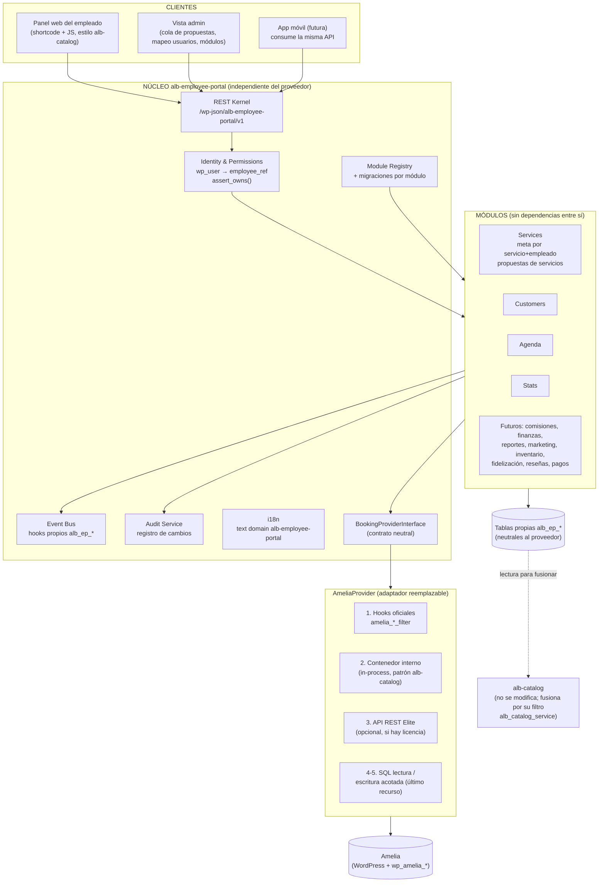
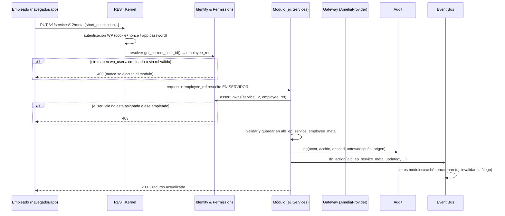
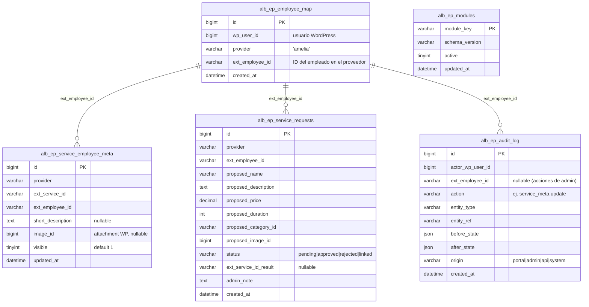

# ALB Employee Portal — Arquitectura definitiva (v1.1, sin código)

> Estado: **RELEASE CANDIDATE 1.0.0-rc.3 — fase de cierre hacia la 1.0.0 estable (instrucciones de Ivanhoe, 2026-07-14, ver recuadro).**
>
> **Reglas de cierre vigentes:** (a) el **respaldo completo del sitio ya está hecho** — no volver a pedirlo; (b) **alcance congelado**: cero funcionalidades nuevas salvo imprescindibles para el alcance original o errores críticos — todo lo demás va a la lista de la v1.1; (c) no modificar Amelia, no modificar alb-catalog salvo incompatibilidad crítica, no crear tablas salvo necesidad absoluta; (d) orden obligatorio: inspector → análisis de Amelia real → escrituras por mecanismos internos seguros → instalar rc.3 → checklist completo → corregir solo lo encontrado → repetir hasta verde → recién entonces etiquetar **1.0.0**.

### Reglas de la fase RC (instrucciones finales de Ivanhoe, 2026-07-14 — vinculantes para toda sesión)

**Al recibir el informe del inspector (protocolo obligatorio):** 1) analizar el informe completo; 2) explicar exactamente qué se descubrió; 3) identificar TODAS las alternativas posibles para las escrituras; 4) justificar técnicamente la opción elegida; 5) **esperar la aprobación explícita de Ivanhoe antes de escribir una sola línea de código**. Nunca implementar una escritura solo porque exista la posibilidad técnica.

**Orden de prioridad para las escrituras hacia Amelia** (nunca elegir una opción inferior si existe una superior suficientemente estable):
1. APIs públicas oficiales.
2. Servicios internos documentados.
3. Command Handlers internos.
4. Contenedor interno de Amelia.
5. Último recurso: acceso directo a BD replicando exactamente la misma lógica que emplea Amelia.

**Validación previa a habilitar cualquier escritura — demostrar:** qué clases se usarán, qué métodos, qué validaciones ejecuta Amelia, qué eventos dispara, qué efectos secundarios produce, y cómo se comporta ante errores.

**Consistencia:** ninguna escritura puede dejar datos inconsistentes. Si una operación no puede garantizar consistencia, se aborta completa. Sin estados intermedios.

**Antes de entregar cualquier RC nueva:** ejecutar todas las pruebas de lo modificado; verificar que no aparecen warnings nuevos; verificar que no aumenta el número de consultas; verificar que Amelia sigue funcionando exactamente igual.

**Condiciones para etiquetar 1.0.0 (todas):** todas las escrituras funcionando; checklist completamente en verde; cero riesgos Altos; cero riesgos Medios sin mitigación; **aprobación explícita de Ivanhoe para publicar**. Hasta entonces, solo Release Candidates. La v1.0 NO está terminada: las escrituras hacia Amelia (crear clientes, modificar precios) son parte del alcance original y siguen pendientes de la verificación en el entorno real. El plan de cierre y el checklist de pruebas están en [`ALB-EMPLOYEE-PORTAL-TESTS.md`](ALB-EMPLOYEE-PORTAL-TESTS.md).**
> Última actualización: 2026-07-10

---

## 0. Resumen ejecutivo

Plugin independiente **`alb-employee-portal`**: panel privado por empleado (servicios, precios, clientes, agenda, estadísticas), primera pieza de una plataforma mayor. Amelia es **proveedor de datos y reservas, no dependencia estructural**: todo contacto con Amelia pasa por un único adaptador reemplazable. `alb-catalog` y el núcleo de Amelia no se modifican.

---

## 1. Requisitos permanentes del proyecto (fijados por Ivanhoe, 2026-07-08)

Estos requisitos rigen todo el desarrollo presente y futuro; ningún módulo puede violarlos:

1. **Núcleo independiente de Amelia.** Amelia es proveedor de datos/reservas. Si mañana se cambia por otro sistema, solo se reemplaza el adaptador del Gateway; el resto de la plataforma no se toca.
2. **Única capa de integración: el Gateway.** Ningún módulo accede directamente a tablas, clases o APIs de Amelia.
3. **Verificar alternativas oficiales antes de crear cualquier tabla propia** (hooks, filtros, servicios internos, APIs). Toda tabla propia lleva su justificación documentada (sección 5.1).
4. **Toda tabla propia con versionado de esquema y migraciones automáticas**, actualizables sin pérdida de datos.
5. **Módulos comunicados solo por interfaces definidas y el Event Bus.** Sin dependencias directas entre módulos.
6. **Auditoría desde el día uno.** Todo cambio importante (precio, servicio, cliente, estado, permisos) queda registrado con usuario, fecha, acción y origen.
7. **API REST diseñada también para la futura app móvil.** Endpoints reutilizables, no específicos de la web.
8. **Toda la lógica de permisos vive en el núcleo.** Nunca se confía solo en el frontend.
9. **i18n desde el inicio** (text domain propio, todas las cadenas traducibles), aunque el primer idioma sea español.
10. **El diagrama completo de arquitectura se aprueba antes de escribir el primer archivo PHP** (sección 2 de este documento).

### Consecuencias de diseño de estos requisitos

- Por el requisito 1, el gateway se define como **interfaz neutral `BookingProviderInterface`** y Amelia es su primer adaptador (`AmeliaProvider`). El núcleo y los módulos hablan en términos neutrales (servicio, empleado, cliente, cita), nunca en términos de Amelia.
- Por la misma razón, las tablas propias usan columnas neutrales: `provider` (valor inicial `'amelia'`), `ext_service_id`, `ext_employee_id`, `ext_customer_id` — no `amelia_service_id`. Cambiar de proveedor no exige migrar nombres de columnas.
- Por el requisito 3, la única tabla nueva que introducen estos requisitos (auditoría) queda justificada en 5.1: ni Amelia ni WordPress ofrecen un registro de auditoría utilizable.

---

## 2. Diagramas de arquitectura (a aprobar antes del desarrollo)

### 2.1. Vista de componentes: clientes → núcleo → módulos → gateway → proveedor

Reglas que el diagrama impone:

- Los clientes solo hablan con el REST Kernel; el REST Kernel solo entrega la request a un módulo después de pasar por Identity & Permissions.
- Los módulos solo conocen: el contrato del Gateway, el Event Bus, el Audit Service y sus propias tablas. **Nunca** a otro módulo ni a Amelia.
- El adaptador `AmeliaProvider` es el único código del sistema que conoce nombres de clases, hooks o tablas de Amelia.

### 2.2. Flujo de permisos (secuencia de una request típica)

Puntos no negociables (requisito 8): el `employee_ref` **jamás** viene del cliente — se resuelve en servidor; un `employee_id` en el body solo sirve para comparar y rechazar con 403 si difiere. El admin es la única excepción y puede indicar empleado explícito.

### 2.3. Modelo de datos propio (tablas `alb_ep_*`, neutrales al proveedor)

Notas:

- Sin foreign keys físicas hacia tablas de Amelia (prohibido el acoplamiento de esquema). Las referencias externas son por valor (`provider` + `ext_*_id`).
- Precio y capacidad por empleado **no aparecen aquí**: siguen en el mecanismo nativo de Amelia (requisito confirmado), accedidos vía Gateway.
- Migraciones (requisito 4): cada módulo declara su `schema_version` en `alb_ep_modules`; al activar el plugin o actualizar, el Module Registry compara versiones y ejecuta migraciones incrementales idempotentes (`dbDelta` + pasos de datos cuando haga falta). Nunca se borra una columna con datos sin migración explícita documentada.

### 2.4. API REST (contrato pensado para web y app móvil por igual)

Namespace versionado `alb-employee-portal/v1`. Recursos, no pantallas (requisito 7):

| Método y ruta | Quién | Qué hace |
|---|---|---|
| `GET /v1/me` | empleado | Perfil resuelto: employee_ref, nombre, permisos efectivos |
| `GET /v1/services` | empleado | Sus servicios asignados, ya fusionados (datos del proveedor + meta propia) |
| `PUT /v1/services/{id}/meta` | empleado | Su descripción corta / imagen / visibilidad para ese servicio |
| `PUT /v1/services/{id}/pricing` | empleado | Su precio/capacidad — el Gateway lo escribe en el mecanismo nativo del proveedor |
| `GET·POST /v1/service-requests` | empleado | Sus propuestas de servicio nuevo / crear propuesta |
| `GET·POST /v1/customers` | empleado | Sus clientes / crear cliente (vía Gateway) |
| `GET /v1/appointments?range=` | empleado | Su agenda (futuras/pasadas/canceladas) |
| `GET /v1/stats/summary?month=` | empleado | Reservas, ingresos estimados, top servicios, clientes recurrentes |
| `GET·PUT /v1/admin/service-requests/{id}` | admin | Cola de propuestas: aprobar/rechazar/vincular |
| `GET·PUT /v1/admin/employee-map` | admin | Mapeo wp_user ↔ empleado del proveedor |
| `GET /v1/admin/audit?filters` | admin | Consulta del registro de auditoría |

Convenciones fijas: JSON siempre; errores con formato único `{code, message, details}`; paginación `page`/`per_page` en toda colección; fechas ISO 8601 UTC; autenticación por cookie+nonce (web) y Application Passwords de WordPress (app móvil, ya soportado por WP core — sin dependencia nueva); las cadenas de la API se sirven traducibles (requisito 9).

### 2.5. Event Bus — eventos del núcleo v1

| Evento (`do_action`) | Lo dispara | Quién escuchará |
|---|---|---|
| `alb_ep_service_meta_updated` | módulo Services | invalidación de caché del catálogo; futuros: marketing, reportes |
| `alb_ep_service_request_created` / `_approved` / `_rejected` | Services | notificaciones; auditoría ya integrada |
| `alb_ep_customer_created` | Customers | futuros: fidelización, marketing |
| `alb_ep_appointment_observed` | Agenda/Stats (al detectar citas nuevas del proveedor) | futuros: comisiones, finanzas, inventario |
| `alb_ep_pricing_updated` | Services | auditoría, futuros: finanzas |
| `alb_ep_module_activated` / `_deactivated` | Module Registry | mantenimiento |

Los módulos futuros **solo** se enganchan a estos eventos y a las interfaces del núcleo — nunca a funciones internas de otro módulo (requisito 5).

---

## 3. Investigación: vías oficiales de extensión de Amelia (verificación del requisito 3)

Investigado en la documentación pública de wpamelia.com (la política de red de esta sesión impidió descargar el código de la versión Lite desde wordpress.org; ver sección 7 para lo pendiente de confirmar en servidor).

### 3.1. Custom Fields de Amelia — NO sirven como metadatos

Son **campos del formulario de reserva que llena el cliente** (texto, dropdown, checkbox, archivos, fechas), adjuntables a servicios pero guardados **en cada reserva**, no en el servicio. No son metadatos administrativos por servicio ni por servicio+empleado. Descartado.

### 3.2. Hooks oficiales de WordPress — SÍ existen; integran, pero no persisten

Amelia documenta filtros/acciones oficiales, incluyendo para servicios: `amelia_before_service_added_filter`, `amelia_before_service_updated_filter`, `amelia_get_service_filter`, `amelia_get_services_filter`, y familias equivalentes para citas, reservas, clientes, usuarios WP, eventos y paquetes.

- ✅ Superficie de integración oficial y estable: reaccionar a cambios del admin, fusionar overrides al recuperar servicios, invalidar cachés. Nivel 1 del adaptador.
- ❌ **No proporcionan almacenamiento**: un filtro modifica datos al vuelo en cada request.

### 3.3. Columna `settings` interna de la entidad servicio — descartada

No documentada como punto de extensión público; una actualización de Amelia puede normalizar ese JSON y eliminar claves desconocidas. Guardar datos propios en un esquema propiedad de otro plugin viola el requisito 1.

### 3.4. Conclusión campo por campo

| Dato | Vía |
|---|---|
| Precio por empleado | **Nativo Amelia** (override en servicios asignados) — sin tabla propia |
| Capacidad mín/máx por empleado | **Nativo Amelia** — sin tabla propia |
| Descripción corta por servicio+empleado | Sin persistencia oficial → tabla propia |
| Imagen por servicio+empleado | Sin persistencia oficial → tabla propia |
| Visibilidad de un servicio para un empleado | Sin mecanismo (Amelia solo oculta al empleado entero) → tabla propia |
| Propuestas de servicios | Concepto inexistente en Amelia → tabla propia |
| Auditoría | Ni Amelia ni WP core ofrecen registro de auditoría utilizable/consultable para esto → tabla propia |
| Mapeo wp_user↔empleado | Amelia tiene su vínculo interno, pero depender de él acoplaría el núcleo al proveedor (violaría requisito 1) → tabla propia, precargable desde el vínculo de Amelia vía Gateway |

---

## 4. Cadena de acceso del adaptador AmeliaProvider

Interno al adaptador — invisible para el núcleo y los módulos:

1. **Hooks/filtros oficiales** (3.2) — preferidos siempre que cubran el caso.
2. **Contenedor interno de Amelia (in-process)** — lecturas confirmadas (patrón `alb-catalog`); escrituras pendientes de verificar en servidor (sección 7).
3. **API REST pública** — solo si la licencia resulta Elite; opcional, jamás requisito.
4. **SQL de solo lectura** — respaldo (patrón `class-amelia-db-source.php`).
5. **SQL de escritura acotado** — último recurso: columnas puntuales de tablas de unión conocidas (ej. precio por empleado), siempre `$wpdb->prepare`, nunca crear/borrar entidades completas.

La **creación de servicios completos jamás pasa por el nivel 5**: el flujo de propuesta→aprobación lo evita por diseño.

---

## 5. Flujo de creación de servicios (propuesta → revisión → aprobación)

1. Empleado crea propuesta desde su panel → `alb_ep_service_requests` (`pending`). No toca Amelia. Evento `alb_ep_service_request_created`.
2. Admin revisa la cola (vista admin del portal).
3. **v1:** al aprobar, el admin crea el servicio en la pantalla nativa de Amelia y vincula la propuesta (`linked` + `ext_service_id_result`).
4. **Futuro:** si el contenedor interno expone un command handler seguro de creación (sección 7), el paso 3 se automatiza — mismo flujo, misma tabla, sin migración.

---

## 6. Módulos

### 6.1. Núcleo (se construye primero)

Identity & Permissions · BookingProviderInterface + AmeliaProvider · REST Kernel · Event Bus · Module Registry con migraciones · Audit Service · i18n. Detallado en los diagramas 2.1–2.5.

### 6.2. Módulos v1

**Services** (meta por servicio+empleado, propuestas, interfaz sobre pricing nativo) · **Customers** · **Agenda** · **Stats**.

### 6.3. Módulos futuros — encaje sin rehacer nada

| Módulo | Encaje |
|---|---|
| Comisiones | Tabla propia de reglas por empleado(+servicio); escucha `alb_ep_appointment_observed` |
| Finanzas | Agregación sobre comisiones+pagos; consume APIs de otros módulos, nunca sus tablas |
| Reportes | Consume Gateway + APIs de módulos; exporta |
| Marketing / promociones | Cupones nativos de Amelia vía Gateway → interfaz de gestión, no motor propio |
| Inventario | Tablas propias por `ext_service_id`/`ext_employee_id`; escucha eventos de cita |
| Fidelización | Tabla de puntos por `ext_customer_id` |
| Reseñas | Tabla propia; se fusiona al catálogo por el filtro `alb_catalog_service` de `alb-catalog` (campo `rating` ya reservado allí) |
| Pagos | Escucha el bus; el cobro de la reserva sigue siendo del proveedor |
| App móvil | Consume `alb-employee-portal/v1` tal cual — la API ES el contrato |

---

## 6.4. Lista de espera para la v1.1 (alcance congelado — NO entra en la 1.0.0)

- Bloqueo optimista en transiciones de propuestas (`UPDATE ... WHERE status = %s`) — auditoría R5.
- Método de gateway `get_service_names()` para abaratar el top-5 de Stats.
- Botón de reintento / distinción de errores de red en el frontend.
- Archivo de traducción al inglés (la infraestructura i18n ya está).
- Rol "Amelia Manager" como admin del portal (hoy solo `manage_options`, decisión consciente).
- Creación automática del servicio en Amelia al aprobar una propuesta (hoy: paso manual + vincular).
- Módulos de la sección 6.3 (comisiones, reseñas, etc.).

## 7. Pendiente de verificación en servidor (no bloquea la aprobación; sí el código de escritura)

Requiere la laptop de Ivanhoe con la extensión de Chrome conectada a wp-admin:

1. **Licencia de Amelia activa** — decide si existe el nivel 3 del adaptador.
2. **Command handlers de escritura en el contenedor interno** (código premium en `wp-content/plugins/ameliabooking/src/`) — decide si crear clientes / escribir precio por empleado va por nivel 2 o cae a 3/5.
3. **Roles & Permissions actual** y comportamiento real de "Allow employees to manage customers" (¿filtra por empleado o muestra todos?).
4. **Vínculo WP user ↔ empleado en producción** (¿todos los empleados tienen login WP?) — precarga de `alb_ep_employee_map`.

---

## 8. Qué sigue

1. ~~Aprobación de los diagramas~~ ✅ Aprobados (2026-07-08).
2. ~~Primer entregable de código~~ ✅ Publicado en [`alb-employee-portal/`](alb-employee-portal/): núcleo (Identity, REST Kernel, Event Bus, Module Registry con migraciones, Audit, i18n), Gateway con adaptador Amelia (lecturas por SQL introspectivo; escrituras devuelven 501 hasta cerrar la sección 7) y módulo Services (meta por servicio+empleado, cola de propuestas). Verificado con lint PHP 8.4 y prueba de humo con stubs de WordPress (armado del núcleo, 13 rutas, 5 migraciones, degradación limpia sin Amelia).
3. ~~Módulos Customers/Agenda/Stats~~ ✅ Publicados: Customers (clientes del empleado agregados desde sus reservas, con búsqueda; alta vía Gateway pendiente de escrituras), Agenda (citas por rango con cliente y precio cuando el proveedor los expone) y Stats (resumen mensual: citas por estado, ingresos estimados, top servicios, clientes recurrentes). Ninguno usa tablas propias — todo se lee del proveedor vía Gateway, cumpliendo la regla de no duplicar datos.
4. ~~Interfaz de usuario~~ ✅ Publicada: shortcode `[alb_employee_portal]`, app sin frameworks con las 5 vistas del empleado, mobile-first, modo oscuro, i18n desde PHP. Verificada renderizando en Chromium con datos simulados (móvil y escritorio, claro y oscuro, cero errores de consola).
5. ~~Vista admin del portal~~ ✅ Publicada: pestañas Cola (aprobar/rechazar/vincular propuestas con filtros por estado), Equipo (estado del sistema + mapeo usuario↔empleado con selector de empleados del proveedor) y Auditoría (paginada). Verificada en Chromium sin errores de consola.

### Plan de cierre de la v1.0 (orden fijado por Ivanhoe, 2026-07-10)

El código actual es **1.0.0-rc.1**. Para llegar a la 1.0 final, en el entorno real y en este orden:

1. Verificar la licencia y la versión instalada de Amelia.
2. Analizar las clases internas responsables de crear servicios, clientes y actualizar precios.
3. Implementar las escrituras usando únicamente los mecanismos internos oficiales de Amelia cuando sea posible.
4. Desplegar el plugin en un entorno de pruebas dentro de albookings.com (página privada, no enlazada).
5. Pruebas completas con datos reales.
6. Revisar registros PHP, consola, rendimiento y compatibilidad.
7. Solo tras superar todas las pruebas, etiquetar 1.0.0 y pasar a producción.

Cada paso tiene sus ítems verificables en **[ALB-EMPLOYEE-PORTAL-TESTS.md](ALB-EMPLOYEE-PORTAL-TESTS.md)** (funcionales, seguridad, regresión, rendimiento y criterios de salida).
