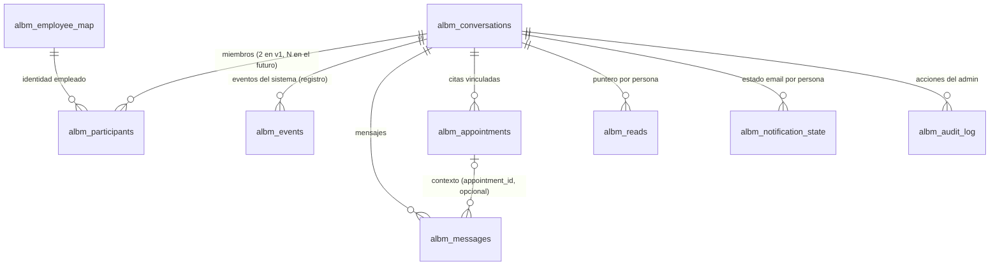
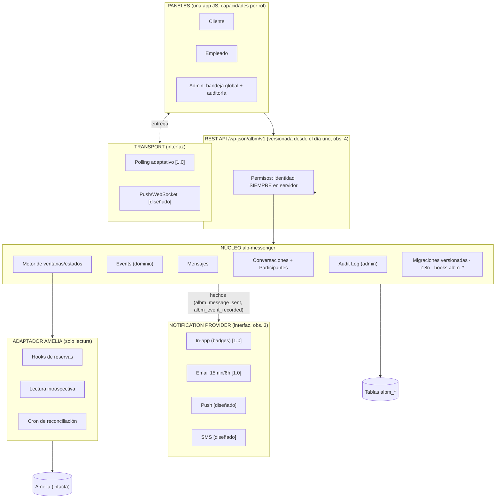

# ALB Messenger — Diseño técnico v1.1 (aprobado, con las 8 observaciones incorporadas)

> Estado: **APROBADO por Ivanhoe (2026-07-16) con cambios menores obligatorios — todos incorporados en esta versión. Etapa 3 (implementación por módulos) autorizada.**
> Implementa las 8 decisiones de producto de la Etapa 1 más las 8 observaciones de la revisión de Etapa 2.
> Última actualización: 2026-07-16

## Regla de oro del proyecto (observación 8)

> **Toda decisión responde: ¿esto es imprescindible para la 1.0?** Si la respuesta es no, se **diseña** para el futuro pero **no se implementa**. Este documento marca cada pieza como `[1.0]` (se implementa) o `[diseñado, NO implementar]`.

---

## 1. Modelo de datos v1.1

### 1.1. Cambios respecto a v1.0 (las observaciones 1, 2, 5, 6 y 7)

1. **Trazabilidad directa + eventos independientes (ajuste final de Ivanhoe, 2026-07-17).** Los mensajes **conservan `appointment_id`** (nullable → `albm_appointments`): un mensaje enviado en la ventana de una cita queda asociado directamente a esa cita — trazabilidad sin indirección. En paralelo, `albm_events` (ConversationEvent) existe como **registro independiente de eventos del sistema** (cancelaciones, reprogramaciones, cambio de empleado, lock/unlock, archivado, reapertura, futuros: pago recibido, cita finalizada…): una fila con `type` + `payload` JSON por hecho. **Esto NO es event sourcing**: los eventos son un registro informativo que el frontend intercala en la línea de tiempo; nunca son la fuente de la que se reconstruye el estado, y los mensajes no dependen de ellos.
2. **Adjuntos reservados (obs. 2)** `[diseñado, NO implementar]`: tabla satélite futura `albm_attachments (id, message_id, kind, storage_ref, meta JSON)`. `albm_messages` **no cambiará** cuando llegue: un mensaje con adjuntos es un mensaje normal con filas satélite. El `payload` JSON del mensaje queda para datos ligeros inline; lo pesado vive en el satélite.
3. **Audit Log ≠ System Events (obs. 5).** Dos tablas, dos responsabilidades: `albm_events` = hechos del dominio (reservas, estados, participantes). `albm_audit_log` = acciones del administrador (abrió, respondió, archivó, bloqueó, exportó). Nunca se mezclan.
4. **Estado `locked` (obs. 6)** `[1.0]`: disputa/fraude/investigación/requerimiento legal. Nadie escribe salvo el admin; los participantes conservan lectura. Solo el admin entra y sale de `locked`, siempre auditado.
5. **Participantes como entidad (obs. 7).** Fuera `customer_wp_id`/`employee_wp_id` de la conversación: la membresía vive en `albm_participants` (rol + referencia al proveedor por persona). La 1.0 crea siempre exactamente 2 participantes; el día que entre recepción o un grupo, son filas nuevas — el esquema no se toca. La unicidad del par v1 se garantiza con `pair_key` (`amelia:{customer_ref}:{employee_ref}`) en la conversación.

### 1.2. Tablas `[1.0]`

```
albm_conversations
  id · provider('amelia') · pair_key varchar(160) UNIQUE
  status: active | readonly | locked | archived
  override_until datetime NULL      ← reapertura manual del admin
  last_message_at datetime NULL · created_at
  INDEX (status, last_message_at)

albm_participants
  id · conversation_id → conversations · wp_user_id
  role: customer | employee            (admin NO es participante: supervisa todo por rol)
  provider_ref varchar(64) NULL        ← id de esa persona en Amelia
  joined_at
  UNIQUE (conversation_id, wp_user_id) · INDEX (wp_user_id)

albm_events                            ← System Events (obs. 1 y 5)
  id · conversation_id → conversations
  type varchar(40)     v1: appointment_linked | appointment_canceled |
                           appointment_rescheduled | employee_changed |
                           conversation_locked | conversation_unlocked |
                           conversation_archived | conversation_reopened
  ext_ref varchar(64) NULL             ← ej. ext_appointment_id
  payload longtext NULL (JSON)         ← datos del hecho (servicio, fechas…)
  created_at
  INDEX (conversation_id, id) · INDEX (type, ext_ref)

albm_appointments                      ← citas vinculadas al hilo + motor de ventanas
  id · conversation_id
  ext_appointment_id UNIQUE · service_name (instantánea)
  starts_at · ends_at · status · writable_until (= ends_at + 48h)
  INDEX (conversation_id, writable_until)

albm_messages
  id · conversation_id → conversations
  appointment_id bigint NULL → appointments   ← trazabilidad DIRECTA por cita (ajuste final)
  sender_wp_id · sender_role: customer | employee | admin   (instantánea; admin = "Soporte")
  type varchar(16) 'text'              (futuros: image, file, voice, location)
  body longtext · payload longtext NULL
  created_at · deleted_at NULL         (borrado suave; retención: jamás se borra)
  INDEX (conversation_id, id) · INDEX (appointment_id)

albm_reads                 PK (conversation_id, wp_user_id) · last_read_message_id · updated_at
albm_notification_state    PK (conversation_id, wp_user_id) · pending_since NULL · last_email_at NULL
albm_audit_log             id · admin_wp_id · conversation_id ·
                           action: read | write | lock | unlock | reopen | archive | export ·
                           created_at · INDEX (conversation_id) · INDEX (admin_wp_id, created_at)
albm_employee_map          id · wp_user_id UNIQUE · provider · ext_employee_id · created_at
```

`[diseñado, NO implementar]`: `albm_attachments` (v1.2+), `albm_reactions` (satélite futuro), canales push/SMS en notificaciones.

### 1.3. Relaciones



### 1.4. Máquina de estados (con `locked`, obs. 6)

```
 [no existe] ──cita confirmada──► ACTIVE ◄──nueva cita del par / override admin──┐
                                    │                                            │
                                    │ todas las ventanas vencidas (cron)     READONLY
                                    ▼                                            │
                                READONLY ──12 meses sin mensajes (cron)──► ARCHIVED
                                    
 ACTIVE / READONLY / ARCHIVED ──admin lock──► LOCKED ──admin unlock──► (estado anterior)
```

- `LOCKED`: nadie escribe salvo admin; participantes solo leen. Entrada/salida exclusiva del admin, auditada y con evento de dominio (las dos responsabilidades de la obs. 5: el *hecho* va a events, la *acción del admin* a audit_log).
- Regla de escritura efectiva (servidor, en cada POST): `status=active ∧ participante ∧ (∃ cita con writable_until > ahora ∨ override_until > ahora)`. El admin escribe siempre — incluso en `locked`, que es precisamente su herramienta para gestionar la disputa — como Soporte y auditado.

---

## 2. Arquitectura de componentes (con la abstracción de notificaciones, obs. 3)



Las **dos abstracciones** que pediste, separadas: `Transport` = *cómo llegan los mensajes al cliente en tiempo real* (polling hoy, push mañana). `Notification_Channel` = *cómo se avisa a quien no está mirando* (in-app y email hoy; push y SMS son implementaciones nuevas de la misma interfaz, consumiendo los mismos hechos del dominio). Añadir un canal jamás toca el núcleo.

---

## 3. Flujos (sin cambios de fondo; actualizados a events y albm/v1)

**Provisionamiento:** hook de Amelia → adaptador resuelve par y usuario WP del cliente → find-or-create conversación por `pair_key` + 2 filas en participants → **evento** `appointment_linked` (payload: servicio, fechas) + fila en albm_appointments (independiente del evento) → estado ACTIVE. Cancelación/reprogramación/cambio de empleado: mismo camino, evento correspondiente, ventanas recalculadas. Cliente histórico sin usuario WP → pendiente visible en el panel admin.

**Mensaje cliente→empleado:** POST → sesión→participante→estado/ventana → sanear → insertar mensaje con `appointment_id` de la cita en ventana (si la hay) → `pending_since` del destinatario si era NULL → 201. El destinatario lo ve por polling (2–10 s); al leer, avanza su puntero y limpia `pending_since`. Cron cada 5 min aplica la regla de email (≥15 min sin leer ∧ ≥6 h desde el último email de ese hilo → 1 email).

**Supervisión:** el admin lee cualquier hilo (audit `read`), escribe siempre como Soporte (`sender_role=admin`, audit `write`), bloquea/desbloquea/reabre/archiva (audit + evento de dominio). El rol sale de la sesión; suplantar es estructuralmente imposible.

---

## 4. Contrato REST — namespace **`/wp-json/albm/v1`** (obs. 4)

Convenciones: JSON; errores `{code, message, details}`; ISO 8601 UTC; cursor de IDs; cookie+nonce (web) / Application Passwords (móvil futuro).

| Ruta | Quién | Notas |
|---|---|---|
| `GET /me` | todos | roles efectivos + refs |
| `GET /conversations` | participante | con unread_count, preview, status, writable |
| `GET /conversations/{id}` | participante/admin | detalle + citas vinculadas (de events/appointments) |
| `GET /conversations/{id}/timeline?before_id=&limit=` | participante/admin | **mensajes y eventos fusionados** cronológicamente (obs. 1); admin → audit read |
| `GET /conversations/{id}/timeline?after_id=` | participante/admin | catch-up para el polling |
| `POST /conversations/{id}/messages {body}` | participante en ventana; admin siempre | 409 `albm_window_closed` fuera de ventana; 423 `albm_locked` si locked (participantes) |
| `PUT /conversations/{id}/read {last_read_message_id}` | participante | puntero solo avanza |
| `GET /poll?cursor=` | todos | 1 consulta; `interval_hint` adaptativo |
| `GET /admin/conversations?search=&status=` | admin | bandeja global |
| `PUT /admin/conversations/{id}/status {status, override_until?}` | admin | active/readonly/locked/archived; audit + evento |
| `GET /admin/audit-log?conversation_id=` | admin | acciones de admin (obs. 5) |
| `GET /admin/events?conversation_id=&type=` | admin | hechos del dominio (obs. 5) |
| `GET /admin/unlinked` | admin | pendientes de identidad |

---

## 5. Matriz de permisos (con `locked`)

| Acción | Cliente | Empleado | Admin |
|---|---|---|---|
| Ver/leer sus hilos | ✅ | ✅ | ✅ todos (+audit read) |
| Escribir en ACTIVE con ventana | ✅ | ✅ | ✅ |
| Escribir en READONLY/fuera de ventana | ❌ 409 | ❌ 409 | ✅ como Soporte (+audit) |
| Escribir en LOCKED | ❌ 423 | ❌ 423 | ✅ como Soporte (+audit) |
| Leer en LOCKED / ARCHIVED | ✅ | ✅ | ✅ |
| lock/unlock/reopen/archive | ❌ | ❌ | ✅ (+audit +evento) |
| Ver audit log / events admin | ❌ | ❌ | ✅ |
| Suplantar otro rol | imposible — el rol sale de la sesión y se congela en sender_role | | |

Defensas transversales: escape total en render (chat = vector XSS clásico), rate-limit de envío (20 msg/min/usuario), longitud máxima, exclusión de caché de páginas de paneles y endpoints.

---

## 6. Etapa 3 — Plan de módulos (método de trabajo de Ivanhoe)

Disciplina acordada: **cada módulo completamente funcional y probado antes del siguiente; desarrollo incremental con rollback posible en cada etapa** (cada módulo = commits aislados en la rama; revertir un módulo no arrastra a los demás).

| # | Módulo | Contenido | Prueba de salida |
|---|---|---|---|
| M0 | Esqueleto + esquema | Bootstrap del plugin, migraciones versionadas, las 9 tablas, i18n, desinstalación conservadora | Harness: activación crea las 9 tablas; segunda activación idempotente y sin consultas extra |
| M1 | Identidad y permisos | Resolución de roles en servidor, mapeo de empleados, middleware REST `albm/v1` | Matriz de permisos ejecutada contra stubs: cada celda ✅/❌ verificada |
| M2 | Conversaciones + eventos + adaptador Amelia | pair_key, participants, events, citas vinculadas, motor de ventanas/estados, hooks + reconciliación | Simulación de ciclo de reserva completo (alta→reprogramación→cancelación) con estados correctos |
| M3 | Mensajes + lecturas | POST/timeline fusionada, punteros, reglas de ventana/locked, saneamiento, rate-limit | Envíos válidos/inválidos, 409/423, XSS almacenado inerte |
| M4 | Polling | Endpoint /poll con cursor + interval_hint | Carga: N usuarios simulados, 1 consulta por poll verificada |
| M5 | Notificaciones | Notification Provider + canales in-app y email (regla 15min/6h) | Simulación temporal: 10:00 mensaje → 10:15 email → silencio 6h |
| M6 | Paneles | UI cliente/empleado (una app, capacidades por rol) | Render en navegador, móvil y escritorio, sin errores de consola |
| M7 | Panel admin | Bandeja global, timeline con eventos, lock/unlock, audit log | Flujos de supervisión completos + auditoría íntegra |

Cada módulo termina con: lint + suite del módulo en verde + commit + push. Ningún módulo empieza con el anterior en rojo.
