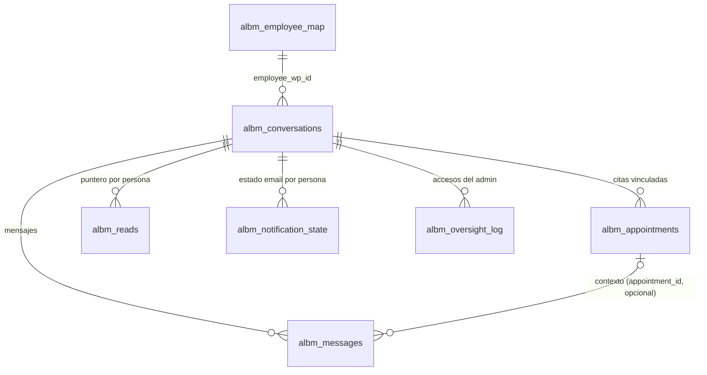
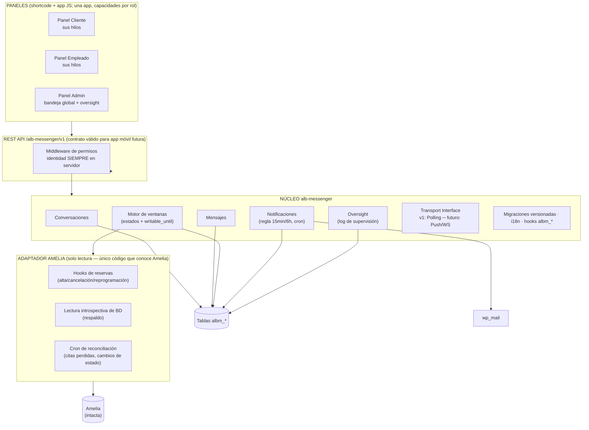
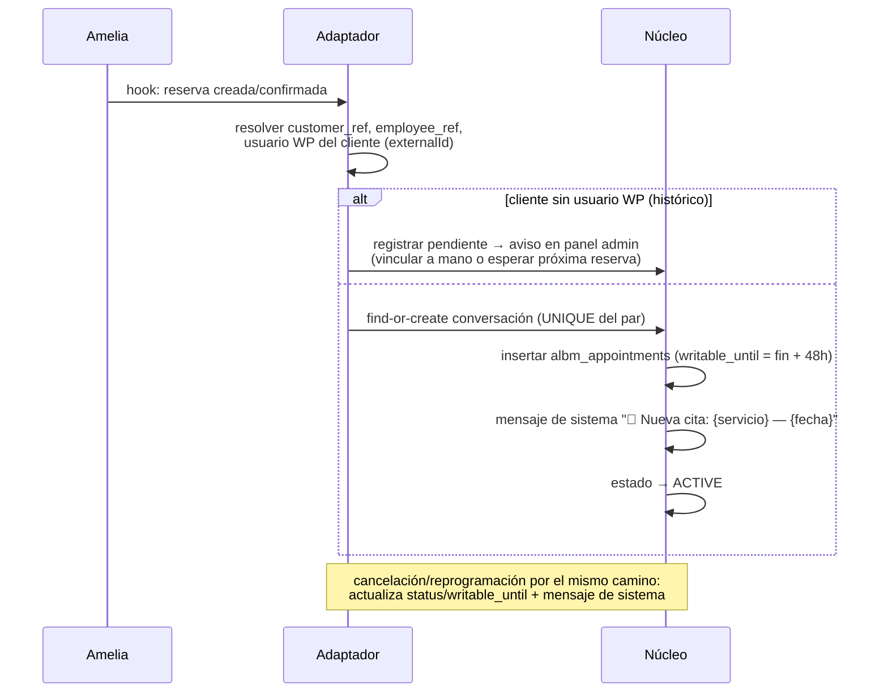
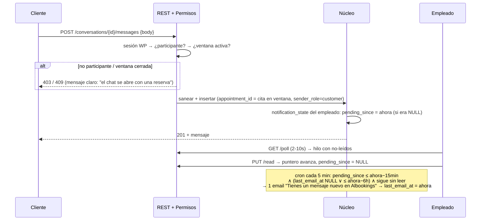

# ALB Messenger — Diseño técnico (Etapa 2, sin código)

> Estado: **entregable de la Etapa 2 — pendiente de revisión de Ivanhoe antes de decidir la implementación.**
> Implementa las 8 decisiones de producto aprobadas el 2026-07-16 (tabla en [`ALB-MESSENGER.md`](ALB-MESSENGER.md) §11 + modificaciones: contexto por cita en los mensajes; email 15 min / máx. 1 cada 6 h por conversación; archivado a los 12 meses sin borrado).
> Última actualización: 2026-07-16

---

## 1. Modelo de datos completo

### 1.1. Decisiones estructurales que responden a tus condiciones

- **Trazabilidad por cita (tu condición del punto 1):** cada mensaje lleva `appointment_id` opcional. Al enviar un mensaje dentro de la ventana de una cita, se asocia automáticamente a esa cita; los mensajes generales quedan con `NULL`. Resultado: el hilo es uno, pero puedes filtrar "todos los mensajes de la Reserva 002" — nada pierde contexto.
- **`sender_role` como instantánea** en cada mensaje (`customer|employee|admin|system`): garantiza que un mensaje escrito por ti como Soporte quede marcado como admin *para siempre*, aunque roles o mapeos cambien después. Es la base técnica de "el admin nunca finge ser el empleado".
- **Leídos por puntero** (una fila por persona y conversación, no por mensaje): O(1) en escritura y lectura, escala a años de historial.
- **Estado de notificación por par (conversación, destinatario)**: implementa exactamente tu regla de email (15 min de gracia + tope de 6 h) con dos timestamps, sin cola compleja.
- Referencias a Amelia **por valor** (`customer_ref`, `ext_appointment_id`); cero foreign keys físicas hacia tablas de Amelia.

### 1.2. Tablas propuestas (prefijo `albm_`)

```
albm_conversations
  id                bigint PK
  provider          varchar(32)  default 'amelia'
  customer_ref      varchar(64)          ← id del cliente en Amelia
  employee_ref      varchar(64)          ← id del empleado en Amelia
  customer_wp_id    bigint               ← usuario WP del cliente (obligatorio, decisión #3)
  employee_wp_id    bigint               ← usuario WP del empleado (del mapeo)
  status            enum: active | readonly | archived
  override_until    datetime NULL        ← reapertura manual por admin (decisión #2: "admin siempre puede")
  last_message_at   datetime NULL
  created_at        datetime
  UNIQUE (provider, customer_ref, employee_ref)     ← garantiza UN hilo por par
  INDEX  (employee_wp_id, last_message_at) · (customer_wp_id, last_message_at)

albm_appointments                        ← las "Reserva 001/002/003" de tu diagrama
  id                  bigint PK
  conversation_id     bigint → albm_conversations
  ext_appointment_id  varchar(64) UNIQUE ← id de la cita en Amelia
  service_name        varchar(255)       ← instantánea para mostrar (si Amelia renombra, el historial no miente)
  starts_at, ends_at  datetime
  status              varchar(32)        ← espejo del estado en Amelia
  writable_until      datetime           ← ends_at + 48h (decisión #2), recalculado si se reprograma
  INDEX (conversation_id, starts_at)

albm_messages
  id               bigint PK
  conversation_id  bigint → albm_conversations
  appointment_id   bigint NULL → albm_appointments   ← trazabilidad por cita (tu condición)
  sender_wp_id     bigint NULL          ← NULL = mensaje de sistema
  sender_role      enum: customer | employee | admin | system   ← instantánea
  type             varchar(16) 'text' | 'system'     (futuros: image, file, voice, location)
  body             longtext             ← texto saneado
  payload          longtext NULL        ← JSON para tipos futuros; NULL en texto
  created_at       datetime
  deleted_at       datetime NULL        ← borrado suave; nada se destruye (decisión #7)
  INDEX (conversation_id, id) · (appointment_id)

albm_reads
  conversation_id + wp_user_id  PK compuesta
  last_read_message_id  bigint
  updated_at            datetime

albm_notification_state                 ← tu regla de email (decisión #6)
  conversation_id + wp_user_id  PK compuesta
  pending_since   datetime NULL   ← primer no-leído sin notificar (arranca el reloj de 15 min)
  last_email_at   datetime NULL   ← aplica el tope de 6 h

albm_oversight_log                      ← supervisión registrada (decisión #4)
  id · admin_wp_id · conversation_id
  action: read | write | reopen | archive | export
  created_at
  INDEX (conversation_id) · (admin_wp_id, created_at)

albm_employee_map                       ← identidad de empleados (propia de este plugin)
  id · wp_user_id UNIQUE · provider · ext_employee_id · created_at
```

Los clientes no necesitan tabla de mapeo: Amelia guarda el usuario WP del cliente en su propio registro (`externalId`) al crearlo automáticamente (decisión #3); el adaptador lo lee y se congela en `customer_wp_id` al provisionar el hilo.

### 1.3. Relaciones entre entidades



### 1.4. Máquina de estados de la conversación

```
                    cita confirmada en Amelia (hook)
   [no existe] ────────────────────────────────────► ACTIVE
                                                        │ writable_until de TODAS las citas vencido
                                                        │ y sin override_until vigente        (cron horario)
                                                        ▼
                    nueva cita del par (hook)        READONLY
   ACTIVE ◄──────────────────────────────────────────  │
   ACTIVE ◄── admin reabre (override_until, logueado)  │ 12 meses sin mensajes (cron diario)
                                                        ▼
                                                     ARCHIVED  ← solo consulta; admin siempre; jamás se borra
```

Regla de escritura efectiva (se evalúa en servidor en cada POST): `participante ∧ (∃ cita con writable_until > ahora ∨ override_until > ahora)` — o `admin` (escribe siempre, como Soporte, y el acceso queda en el oversight log).

---

## 2. Diagrama de arquitectura



---

## 3. Flujos

### 3.1. Provisionamiento (Amelia → messenger)



### 3.2. Mensaje cliente → empleado (con la regla de email)



### 3.3. Supervisión del administrador

```mermaid
sequenceDiagram
    participant Adm as Admin (Ivanhoe)
    participant API as REST + Permisos
    participant N as Núcleo

    Adm->>API: GET /admin/conversations (bandeja global, búsqueda)
    Adm->>API: GET /conversations/{id}/messages
    API->>N: oversight_log: action=read (silencioso para los participantes)
    Adm->>API: POST /conversations/{id}/messages
    API->>N: sender_role=admin → burbuja "Soporte AL Bookings" + oversight_log: write
    Note over API,N: el admin escribe aunque la ventana esté cerrada;<br/>jamás puede enviar como cliente o empleado (el rol sale de la sesión, no del payload)
```

---

## 4. Contratos REST (`/wp-json/alb-messenger/v1`)

Convenciones: JSON; errores `{code, message, details}`; fechas ISO 8601 UTC; paginación por cursor de IDs (estable con inserciones concurrentes, mejor que page/per_page para un chat); autenticación por cookie+nonce (web) y Application Passwords (app móvil futura) — mismo contrato.

| Método y ruta | Quién | Contrato |
|---|---|---|
| `GET /me` | todos | `{wp_user_id, display_name, roles[], customer_ref?, employee_ref?}` |
| `GET /conversations` | participante | Sus hilos: `{id, peer:{name, avatar?}, status, writable, unread_count, last_message:{preview, created_at, sender_role}}` — orden `last_message_at` desc |
| `GET /conversations/{id}` | participante/admin | Detalle + `appointments[]` (las "Reserva 001…" con fechas y estado) |
| `GET /conversations/{id}/messages?before_id=&limit=50` | participante/admin | Página hacia atrás (historial); admin registra `read` en oversight |
| `GET /conversations/{id}/messages?after_id=` | participante/admin | Catch-up hacia adelante (lo usa el polling al entrar al hilo) |
| `POST /conversations/{id}/messages` `{body, appointment_id?}` | participante en ventana; admin siempre | 201 + mensaje. 403 no participante · 409 ventana cerrada (código `albm_window_closed`). `appointment_id` se valida contra el hilo; si se omite, el servidor asigna la cita en ventana |
| `PUT /conversations/{id}/read` `{last_read_message_id}` | participante | Avanza el puntero (nunca retrocede); limpia `pending_since` |
| `GET /poll?cursor=` | todos | Ligero (1 consulta): `{cursor, interval_hint, items:[{conversation_id, last_message_at, unread_count}]}` — solo hilos con novedades desde el cursor |
| `GET /admin/conversations?search=&status=&page=` | admin | Bandeja global con filtros |
| `PUT /admin/conversations/{id}/status` `{status, override_until?}` | admin | Reabrir (override), archivar; oversight `reopen/archive` |
| `GET /admin/oversight-log?conversation_id=&page=` | admin | El registro de supervisión (decisión #4) |
| `GET /admin/unlinked` | admin | Clientes/empleados con reservas pero sin usuario WP o sin mapeo (los "pendientes" de 3.1) |

El polling es el único endpoint pensado para golpearse cada pocos segundos: una consulta indexada sobre `last_message_at > cursor` de los hilos del usuario, sin joins pesados, con `interval_hint` para que el cliente se adapte (5 s pestaña visible / 30 s oculta / backoff con errores).

---

## 5. Sistema de permisos (matriz completa)

Identidad: sesión WP → rol efectivo. `admin` = `manage_options`. `employee` = fila en `albm_employee_map`. `customer` = usuario WP referenciado por un cliente de Amelia (o participante ya congelado en un hilo). Los roles no son excluyentes; nada del payload del cliente decide identidad — solo la sesión.

| Acción | Cliente | Empleado | Admin |
|---|---|---|---|
| Ver SUS hilos | ✅ | ✅ | ✅ (además, todos) |
| Leer mensajes de su hilo | ✅ | ✅ | ✅ cualquier hilo (**+ log read**) |
| Escribir en ventana activa | ✅ | ✅ | ✅ |
| Escribir fuera de ventana | ❌ 409 | ❌ 409 | ✅ (como Soporte, **+ log write**) |
| Escribir suplantando otro rol | ❌ imposible (rol = sesión) | ❌ | ❌ el admin SIEMPRE sale como Soporte |
| Ver hilos de otros pares | ❌ 403 | ❌ 403 | ✅ |
| Reabrir/archivar hilos | ❌ | ❌ | ✅ (**+ log**) |
| Ver oversight log | ❌ | ❌ | ✅ |
| Marcar leído | solo su puntero | solo su puntero | su puntero (no altera los ajenos) |

Defensas transversales: saneamiento de texto en servidor y escape total en render (un chat es el vector XSS clásico); rate-limit de envío (p. ej. máx. 20 mensajes/min por usuario) contra spam/floods; longitud máxima de mensaje; los endpoints de polling y paneles excluidos de caché de página.

---

## 6. Qué queda explícitamente fuera de la v1.0 (recordatorio de alcance)

Imágenes/archivos/voz/ubicación (el esquema ya los admite por `type`+`payload`), "escribiendo…", reacciones, traducción/IA, push/SMS, app móvil (la API ya es su contrato). Nada de esto se implementa ahora.

---

## 7. Riesgo residual señalado en esta etapa

1. **Doble identidad borde:** un usuario WP que sea a la vez empleado y cliente (se reserva a sí mismo u otro empleado le hace un servicio) — soportado por diseño (roles no excluyentes), pero se probará explícitamente.
2. **Reasignación de cita a otro empleado en Amelia:** la cita se re-vincula al hilo del nuevo par (mensajes de sistema en ambos hilos); el hilo viejo conserva su historial. Cubierto por el cron de reconciliación.
3. **wp-cron en sitios de poco tráfico** puede retrasar los emails de 15 min: se documentará activar el cron del sistema en Cloudways (ya disponible en el panel) para el sitio.

---

## Siguiente paso

Revisión de Ivanhoe de este diseño. Con su aprobación se decide la implementación (Etapa 3); sin ella, no se escribe código.
